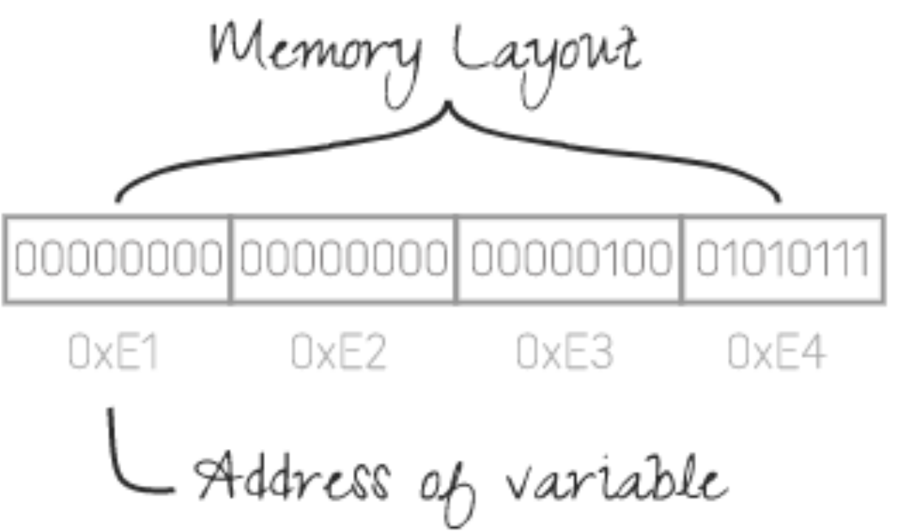
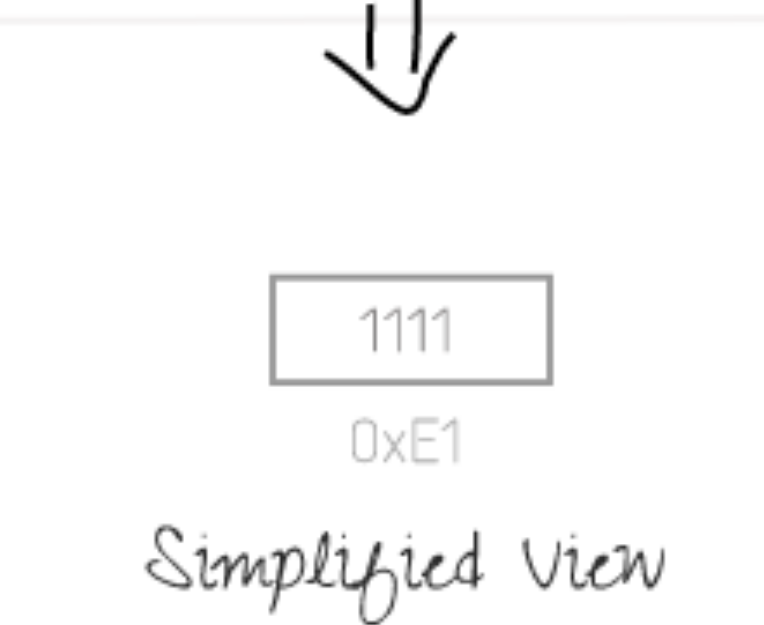
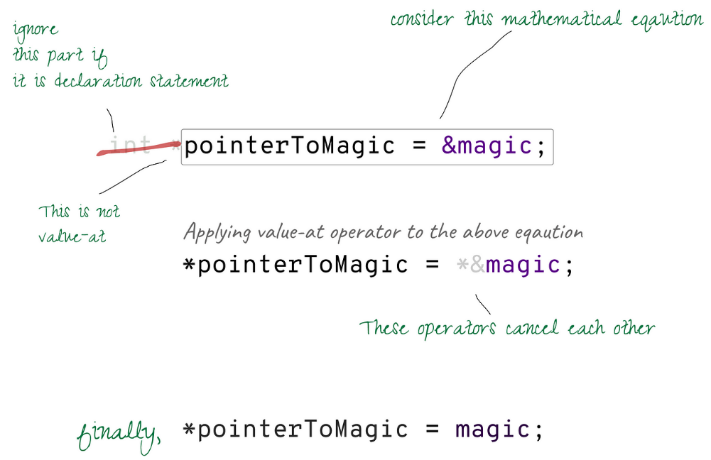
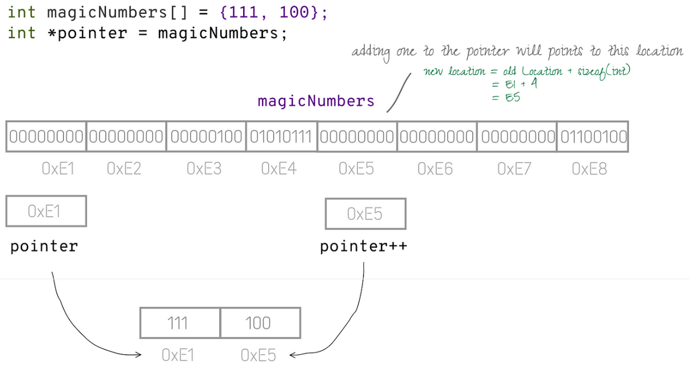

# Introducción a punteros 

El concepto de punteros es fundamental en programación.

## Variables

```cpp
int m = 1111; // tipo, nombre, valor y dirección
```
* Cada byte de la memoria tiene una dirección que el procesador puede usar para leer o escribir datos

* Una variable puede abarcar varios bytes. Por ejemplo una variable de tipo `int` se almacena en 4 bytes; tiene 4 direcciones pero siempre usamos la dirección del primer byte, por lo tanto, **la dirección de una variable siempre signnifica la dirección de su primer byte** ¿?

## Punteros

Un puntero en una variable que apunta a otra variable. **El valor de un puntero es la dirección de memoria de otra variable**

```cpp
int *ptr = &m;
```

Representación gráfica ¿?






* Ejemplos
```cpp
// --- Ejemplo-1 ---
int a = 2;
int *pointerToA = &a; // declaración e inicialización

// --- Ejemplo-2 ---
int *pointerToB; //declaración
int b = 3;

// * es usado solo para declarar
pointerToB = &b; //asignación


// --- Ejemplo-3 ---
int *pointerToArray;
int array[] = {1, 2, 3};

// & no es usado en caso de arreglos
// RECORDAR: El nombre de un arreglo es un puntero a su primer elemento
pointerToArray = array;

// --- Ejemplo-4 ---
char *pointerToString;

// & no es usado. RECORDAR: una cadena es un arreglo
pointerToString = "hola";

// --- Ejemplo-5 ---
// declaración de 2 o más punteros
int *p1, *p2;

// --- Ejemplo-6 ---
int* p1, v; // solo p1 es puntero, v is una variable entera
```
* El tipo de una variable puntero en C++ se especifica con el tipo de datos al que apunta seguido de un asterisco (*). Por lo tanto el tipo que establecemos en el momento de la declaración **es el tipo de la variable referenciada**. Es útil para realizar aritmética de punteros.

* `void *` (Puntero genérico) se utiliza si no se conoce el tipo de variable a la que se hace referencia.


## ¿Por qué necesitamos punteros?
Un puntero facilita el acceso indirecto a una variable. Esta característica permite pasar variables a funciones de forma eficiente.

Normalmente, cuando pasamos valores a una función, estos valores se copian en los parámetros de la función. 

```cpp
func(a,3); // llamada a la función

//INTERNAMENTE
int p = a;     int s = 3;

int func(int p, int s){
    // ...
}
``` 

* Copiar no es un problema para los tipos escalares (de valor único), pero sería un impacto en el rendimiento para los tipos de valores múltiples (cadena, matriz, tipos definidos por el usuario).

* ¿Cuál es entonces la solución? Enviar los valores de forma indirecta. Los punteros facilitan la transmisión indirecta de los valores.

* etc...próxima clase


## ¿Cómo puedo acceder al valor de la variable referenciada a través del puntero?

El operador de Desrreferencia (valor-en) se utiliza para acceder a la variable a la que apunta un puntero. Lamentablemente, el símbolo *(asterisco) se ha reutilizado para este propósito. 

* Lista de especificadores de formato en C [ref1](https://www.geeksforgeeks.org/format-specifiers-in-c/), [ref2]( https://unstop.com/blog/format-specifiers-in-c).


```cpp 
   int a = 5;
int *pointerToA = &a;

a = 6;

// * usado como operador de desrrerferencia
// siempre que usa  * fuera de la sintáxis de declaración

// accediendo al valor a través de punteros
cout << *pointerToA <<endl; //printf("%d\n", *pointerToA); // print 6

// escribiendo valor al puntero
*pointerToA = 8;
cout << a << endl; //printf("%d\n", a); //print 8

// Leyendo un nuevo valor ingresado por el usuario
cout << "Ingrese un nuevo valor a almacenar en  a: " ;
cin >> *pointerToA; //scanf("%d", pointerToA); // equivalente a scanf("%d", &a);

char cad[] = "hello";
char * pointerTocad =  cad;

// falta '*' aquí ?: no es necesario para matriz o cadena
cout << pointerTocad << endl; //printf("%s\n", pointerToHello);
```

## Analogía matemática
Podemos interpretar la asignación de punteros como ecuaciones matemáticas



```cpp
int a = 5;
int *pointerToA = &a;

int **pointerToPointerToA = &pointerToA;

printf("%d", a); // print 5

// pointerToA = &a; __eq0
// *pointerToA = *&a; // applying * (value-at)
// *pointerToA = a; // * and & cancel each other
// *pointerToA = a; __eq1
print("%d", *pointerToA); // print a's value

// pointerToPointerToA = &pointerToA; __eq2
// *pointerToPointerToA = pointerToA; // applying *
// **pointerToPointerToA = *pointerToA; // applying ** again
// thus **pointerToPointerToA = a __from eq1
print("%d", **pointerToPointerToA); //print a's value
```

## Aritmética de Punteros
Se puede sumar o restar un número entero a un puntero. Puede utilizar esta construcción para iterar a través de un arreglo o una cadena. Pero tenga en cuenta que solo puede realizar este cálculo si ha especificado el tipo declarado del puntero. Para sumar un número a un puntero se sigue la siguiente ecuación:

``new-location = old-location + number x sizeof(<type you declared>);``



* Ejercicio: Escribir un programa que utilice punteros y calcule la longitud de una cadena 
```cpp
//completar...corregir errores
// Calculating the length of string
const char *hello = "hello";
const char *i = hello; // i point to hellow first character
int length = 0;
while (*i != '\0') {
  length++;
  i++; // aritmética de punteros: move to next character
}
cout << "La longitud de " << hello << " es " << length <<endl;
//printf("length of %s is %d", hello, length);
``` 


## Representación gráfica de  punteros
Visitar el siguiente link https://pythontutor.com/cpp.html#mode=edit
